# Kafka-Ecommerce-Analytics
# Apache Kafka Event Streaming System

This repository demonstrates an end-to-end event streaming architecture built using Apache Kafka and Python. The project covers Kafka fundamentals, producer-consumer communication, consumer groups, partition rebalancing, poison message handling, and a ride-sharing event processing pipeline.

---

## Technologies Used

- Apache Kafka
- ZooKeeper
- Python
- kafka-python
- Docker Compose
- GitHub

---

# Kafka Mode Used

This project uses **ZooKeeper Mode**.

ZooKeeper is responsible for cluster coordination, broker management, leader election, and metadata storage. Kafka brokers communicate with ZooKeeper to maintain cluster state. Although newer Kafka versions support KRaft mode, this project was implemented using ZooKeeper for simplicity and compatibility with local development environments.

---

# Project Structure

```text
Kafka-Ecommerce-Analytics/
│
├── data/
│   ├── orders.csv
│   └── Screenshots/
│
├── docs/
│   ├── Phase1/
│   └── Phase2/
│
├── src/
│   ├── Phase2/
│   │   ├── Producer/
│   │   │   ├── OrderProducer.py
│   │   │   └── PoisonProducer.py
│   │   │
│   │   └── Consumer/
│   │       ├── OrderConsumer.py
│   │       └── OrderConsumerInstance2.py
│   │
│   └── Phase3/
│       ├── ride_producer.py
│       ├── completed_consumer.py
│       ├── earnings_driver.py
│       └── top_drivers.py
│
├── docker-compose.yml
├── README.md
└── pom.xml
```

---

# Setup Instructions
## Phase 1
## Step 1 - Install Dependencies

```bash
pip install kafka-python
```

## Step 2 - Start Kafka and ZooKeeper

```bash
docker compose up -d
```
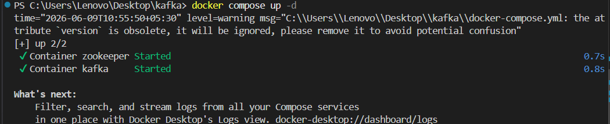


Verify containers:

```bash
docker ps
```


---

## Step 3 - Create Topics

### Phase 2 Topic

```bash
docker exec -it kafka kafka-topics \
--create \
--topic ecommerce.orders \
--bootstrap-server localhost:9092 \
--partitions 3 \
--replication-factor 1
```
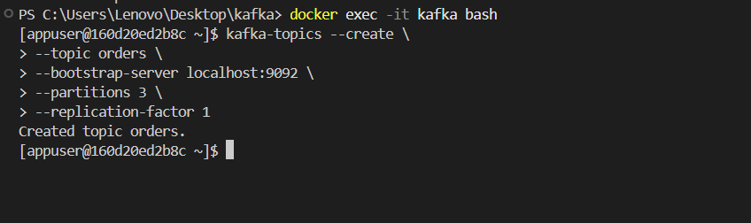

---


# Phase 2 - E-Commerce Orders Pipeline

## Topic Used

```text
ecommerce.orders
```

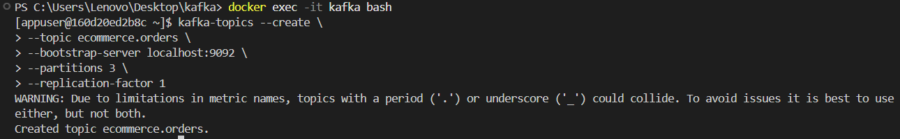

## Dataset

The producer reads order events from:

```text
data/orders.csv
```

Fields:

- order_id
- user_id
- product_id
- amount
- timestamp

---

## Task 2.1 - Producer

Reads records from CSV and publishes them to Kafka using `order_id` as the message key.

Run:

```bash
python src/Phase2/Producer/OrderProducer.py
```
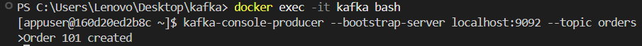

---

## Task 2.2 - Consumer

Consumes messages from `ecommerce.orders`, prints records, and maintains a running count of orders per user.

Run:

```bash
python src/Phase2/Consumer/OrderConsumer.py
```
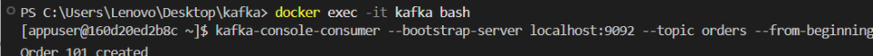


```bash
Adding Message
```
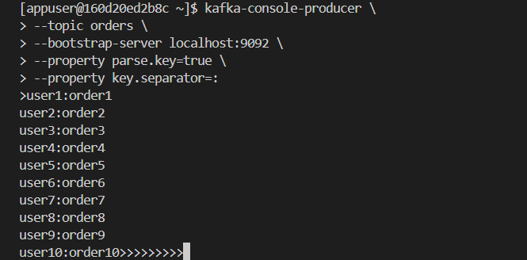

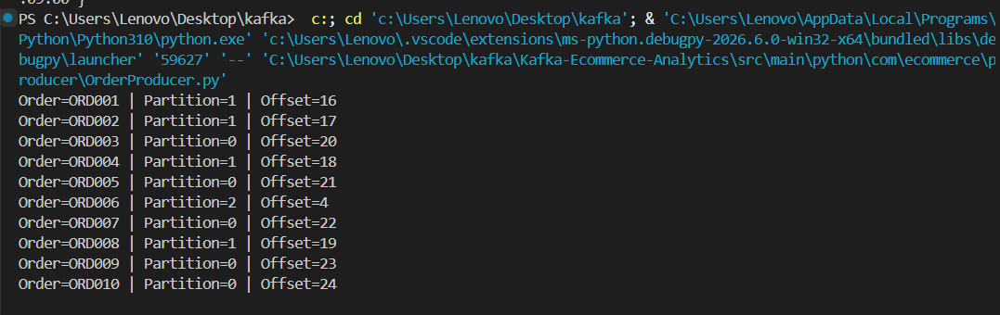

---


## Task 2.3 - Consumer Rebalancing

Run two consumers in the same group.

Terminal 1:

```bash
python src/Phase2/Consumer/OrderConsumer.py
```


Terminal 2:

```bash
python src/Phase2/Consumer/OrderConsumerInstance2.py
```


Demonstrates partition assignment and consumer group rebalancing.

---

## Task 2.4 - Poison Message Handling

### Poison Producer

```bash
python src/Phase2/Producer/PoisonProducer.py
```
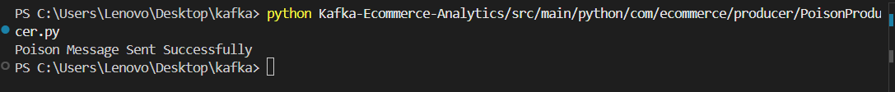
### Poison Consumer Output

```text
POISON MESSAGE DETECTED

Raw Value: INVALID_JSON_MESSAGE

Skipping message...
```
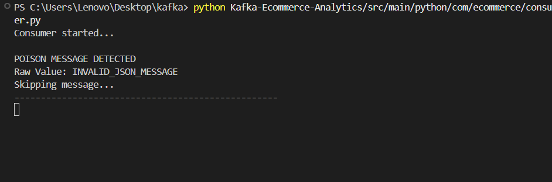

---

# Phase 3 - Ride Sharing Pipeline

## Topics Used

### ride.events

Stores all ride events.

Fields:

- ride_id
- driver_id
- rider_id
- status
- lat
- lon
- timestamp

Statuses:

- REQUESTED
- ACCEPTED
- COMPLETED
- CANCELLED

### ride.completed

Stores only completed ride events.

### driver.earnings

Stores aggregated driver statistics.

---

## Pipeline Flow

```text
Ride Producer
      │
      ▼
 ride.events
      │
      ▼
Completed Ride Consumer
      │
      ▼
 ride.completed
      │
      ▼
Driver Earnings Consumer
      │
      ▼
Top Drivers CLI
```

---

## Task 3.1 - Ride Producer

```bash
python src/Phase3/ride_producer.py
```
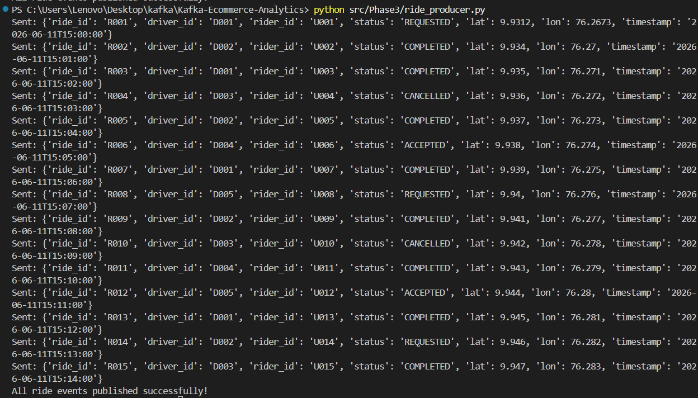
---

## Task 3.2 - Completed Ride Consumer

```bash
python src/Phase3/completed_consumer.py
```
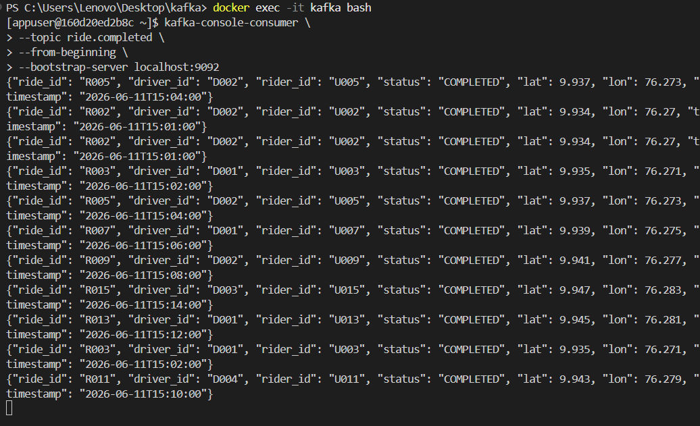

Filters only completed rides and forwards them to `ride.completed`.

---

## Task 3.3 - Driver Earnings Aggregator

```bash
python src/Phase3/earnings_driver.py
```

Flat rate:

```text
$5 per completed ride
```
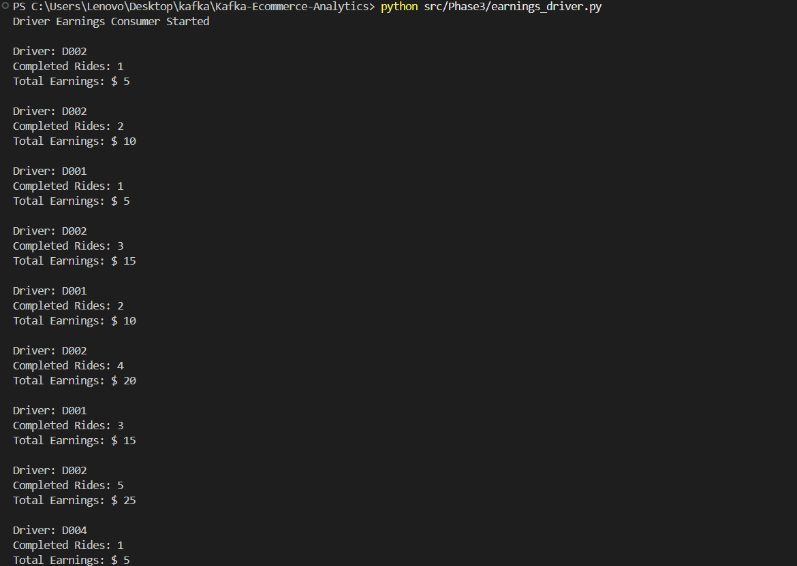
---

## Task 3.4 - Top Drivers CLI

```bash
python src/Phase3/top_drivers.py
```

Displays top drivers ranked by completed rides.

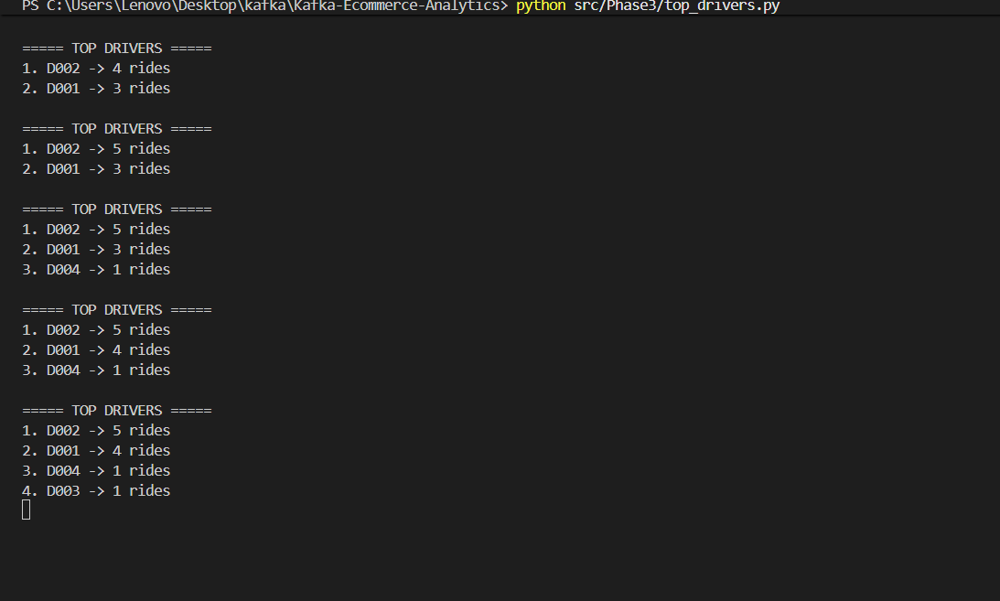
---

# Screenshots

Evidence and execution outputs are available under:

```text
data/Screenshots/
```

- Phase1 screenshots
- Producer outputs
- Consumer outputs
- Rebalancing demo
- Poison message handlinga
- Ride-sharing pipeline execution

---

Conclusion

This repository demonstrates Apache Kafka fundamentals and event-driven application development using Python and ZooKeeper through:

E-Commerce Orders Processing System
Ride Sharing Event Analytics Pipeline

The implementation covers producer-consumer communication, consumer groups, partition rebalancing, poison message handling, event filtering, and real-time analytics using Apache Kafka.